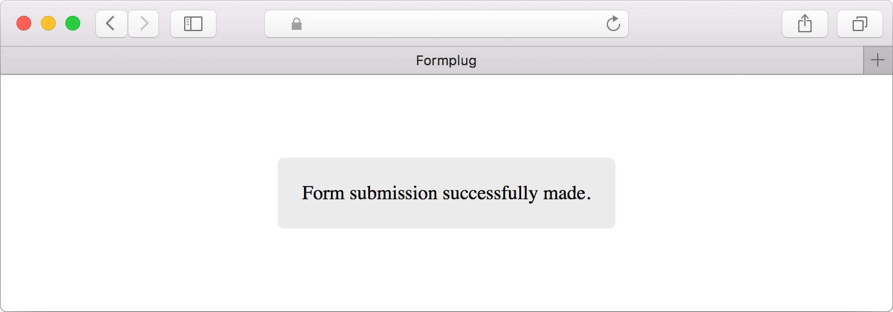

# Formplug
[](https://travis-ci.org/danielireson/formplug-serverless)
[](https://david-dm.org/danielireson/formplug-serverless)

Formplug is a form forwarding service for AWS Lambda, use it to accept form submissions by email without server-side code. It's built using the Serverless Framework and uses Amazon SES to send emails.

**Now with reCAPTCHA (v2) support!**. See [the reCAPTCHA quick-start](#recaptcha-quick-start) for instructions.

## Usage
### Basic
Set the form action to your Formplug endpoint to have form submissions forwarded on by email. Email addresses can be passed in plain text (as in the example below) or encrypted as a hexedecimal string (see next section).
``` html
<form action="https://apigatewayurl.com" method="post">
    <input type="hidden" name="_to" value="johndoe@example.com">
    <input type="text" name="message">
    <input type="submit" value="send">
</form>
```

### reCAPTCHA quick-start:

Go to https://www.google.com/recaptcha and set up an account from the admin console.

Adding an [**invisible** reCAPTCHA](https://developers.google.com/recaptcha/docs/invisible) to your form is as simple as the following:

```html
  <head>
    <script src="https://www.google.com/recaptcha/api.js" async defer></script>
    
    <script type='text/javascript'>
      function onSubmit(token) {
        document.getElementById("contact-form").submit();
      }
    </script>
  </head>

  <body>
    ...
    <form action="https://apigatewayurl.com" method="post" id='contact-form'>
      <input type="hidden" name="_to" value="johndoe@example.com">
      <input type="text" name="message">
      <button class="g-recaptcha" data-sitekey="<YOUR SITE KEY>" data-callback='onSubmit'>Submit</button>
    </form>

  </body>
```

For additional information on other reCAPTCHA widgets, see the [reCAPTCHA v2 documentation](https://developers.google.com/recaptcha/docs/display). You will also need to supply your SECRET key in `config.json`. See [the configuration section](#add-config) for additional information.

### AJAX
Append *format=json* to the query string of the endpoint to get responses back in JSON with a CORS allow all origin header. You should do this if you plan on working with the API using JavaScript.
``` html
<form action="https://apigatewayurl.com?format=json" method="post">
    <input type="hidden" name="_to" value="johndoe@example.com">
    <input type="text" name="message">
    <input type="submit" value="send">
</form>
```

### Special inputs
Name | Description | Multiple emails | Required 
--- | --- | --- | ---
_to | Email address of the primary recipient. | N | Y
_cc | Email addresses to receive a carbon copy. | Y | N
_bcc | Email addresses to receive a blind carbon copy. | Y | N
_replyTo | Email addresses to set as reply to addresses. | Y | N
_honeypot | A spam prevention field that should be hidden for regular website users. The submission will be ignored if the the _honeypot input is present and not empty. | / | N
_redirect | A URL to redirect users to after a successful form submission. | / | N

#### Dynamically changing recipients
Use a *select* if you want to change where the email goes based on a user choice.
``` html
<select name="_to">
  <option value="johndoe@example.com">Recipient option 1</option>
  <option value="janedoe@exmaple.com">Recipient option 2</option>
</select>
```

#### Accepting multiple email addresses
Separate multiple email addresses by a semicolon.

``` html
<!-- plain text emails -->
<input type="hidden" name="_cc" value="johndoe@example.com;janedoe@exmaple.com"

<!-- encrypted emails -->
<input type="hidden" name="_cc" value="ff19d0abcd474813ad;c031a9b24855090b5e8b">
```

#### Using the honeypot
When using the honeypot field you should use CSS to hide the input and keep the type as *text*.

``` html
<input type="text" name="_honeypot" value="" style="display:none">
```

#### Customising messages
Users will be shown a generic form submission success message if a redirect URL isn't provided. This message can be customised through adding a *MSG_RECEIVE_SUCCESS* entry to *config.json*. Similarly, the subject line for emails can be customised through *MSG_SUBJECT* in *config.json*.



## Encryption
Email addresses can be encrypted so that they're not visible in the HTML source. Ensure *ENCRYPTION_KEY* in *config.json* is set to a unique random value as this is used to determine the encrypted values.

### Encrypting an email address
``` bash
> npm run encrypt johndoe@example.com
johndoe@example.com => ff17d6a0cd474813adc031a9b24855090b5e8b
```

### Decrypting an email address
``` bash
> npm run decrypt ff17d6a0cd474813adc031a9b24855090b5e8b
ff17d6a0cd474813adc031a9b24855090b5e8b => johndoe@example.com
```

## Setup
### Clone this repository to a location of your own choosing:

```
git clone git@github.com:danielireson/formplug-serverless.git
```

### Install Serverless
Follow the instructions on the [Serverless website](https://serverless.com/framework/docs/providers/aws/guide/installation) to install the Serverless Framework and setup your AWS credentials.

### Setup SES identity
Amazon SES can only send emails from addresses that you have verified ownership of. Verification can be done using the [AWS Management Console](https://aws.amazon.com) by visiting the SES Dashboard and heading to Identity Management. AWS also puts new SES accounts under limits which prevent emails from being sent to email addresses that haven't been verified. Check out the relevant [AWS SES documentation](http://docs.aws.amazon.com/ses/latest/DeveloperGuide/request-production-access.html) for more information. The limits can be lifted by opening a support ticket as outlined in the docs, but this takes a few hours to approve.

### Install dependencies
Run `npm install` to get the dependencies.

### Add config
Create a copy of *config.sample.json* as *config.json* and then customise as appropriate for your setup.

Name | Description | Required
--- | --- | ---
SERVICE_NAME | The private name for the service. | Y
ENCRYPTION_KEY | A random string used for encryption. | Y
REGION | The AWS region to deploy to (this should be either *eu-west-1*, *us-east-1*, or *us-west-2* as these are the only SES supported regions). | Y
STAGE | The AWS stage to deploy to (it's common to use *dev* or *prod*). | Y
SENDER_ARN | The [ARN](http://docs.aws.amazon.com/general/latest/gr/aws-arns-and-namespaces.html) of the sender email address. | Y
MSG_RECEIVE_SUCCESS | This is returned to the user on a successful form submission if a redirect URL isn't provided. | N
MSG_SUBJECT | The subject line to use in emails. | N
RECAPTCHA_SECRET_KEY | The reCAPTCHA secret key. See the [reCAPTCHA v2 documentation](https://developers.google.com/recaptcha/docs/display). | N

### Deploy
Run `serverless deploy` to deploy to AWS.
